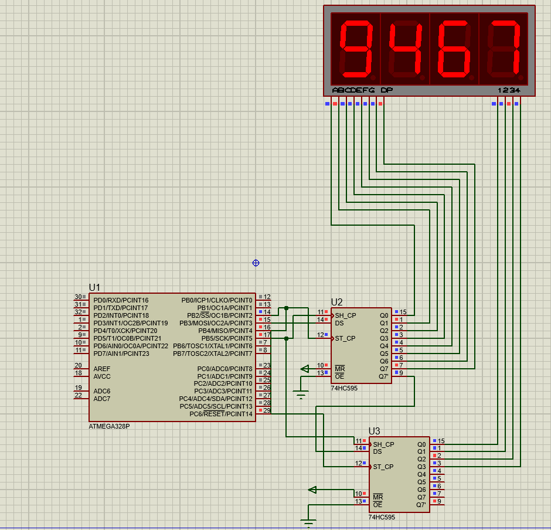

## Table of Contents

- [Overview](#-overview)
- [Features](#-features)
- [Usage](#-usage)
- [Simulation](#-Simulation)


- ##  Overview

Welcome to the **SPI 7-Segment Display Driver**! This project shows how to interface a **4-digit 7-segment display** with an **ATmega328P** using **SPI** and **74HC595 shift registers**.

Instead of wasting multiple GPIO pins, this design uses just **3 pins** to control all segments and digits. It includes proper **multiplexing logic** for smooth display rendering and supports both **common anode** and **common cathode** configurations.

## Features

###  Key Advantages

| Feature | Direct Drive | This Project |
|---------|-------------|--------------|
| **GPIO Pins Used** | 12+ pins | **3 pins** |
| **MCU Load** | High | **Low (Hardware SPI)** |
| **Display Type** | Fixed | **CA & CC Supported** |
| **Scalability** | Limited | **High (Daisy-chain)** |
| **Brightness** | Constant | **Multiplexed (High Peak)** |

### 🔧 Technical Specifications
- **Protocol:** SPI (Mode 0, MSB First)
- **Shift Registers:** 2x 74HC595 (16-bit output)
- **Refresh Rate:** ~500Hz (2ms per digit)
- **Microcontroller:** ATmega328P @ 16MHz
- **Display:** 4-Digit 7-Segment (Multiplexed)


---


##  Usage


```c
void main(void)
{
    spi_init();
    
    while(1)
    {
        send_16bit(0x01, 0xF9);  // Digit 1 = 1
        delay_ms(2);
        send_16bit(0x02, 0xA4);  // Digit 2 = 2
        delay_ms(2);
        send_16bit(0x04, 0xB0);  // Digit 3 = 3
        delay_ms(2);
        send_16bit(0x08, 0x99);  // Digit 4 = 4
        delay_ms(2);
    }
}

send_16bit(digit, segment)
     │          │
     │          └─→ Segment pattern (0xC0-0x90 for 0-9)
     └─→ Digit select (0x01, 0x02, 0x04, 0x08)

```
## Simulation
<p align="center">
  
</p>

This circuit features an **ATmega328P microcontroller** driving a 4-digit 7-segment display through **SPI protocol** and two **74HC595 shift registers**. The first register (U2) manages digit selection via its Q0-Q7
outputs to activate individual display positions, while the second register (U3) controls the segment patterns (A-G and DP) to form numeric characters. Communication occurs through three SPI pins: PB2 for latching (ST_CP), PB3 for data transmission (MOSI/DS), and PB5 for clock synchronization (SH_CP). The shift registers are **daisy-chained** with U2's Q7' output feeding into U3's data input, enabling efficient 16-bit data transfer. Using **multiplexing**, the system rapidly cycles through each digit with 2ms refresh intervals, leveraging persistence of vision to create a stable, flicker-free display showing "9467". The display operates in **common anode mode**, requiring inverted logic where logic 0 illuminates segments. Current-limiting resistors protect the LEDs and maintain uniform brightness across all segments.


## Hardware 


https://github.com/user-attachments/assets/1b9b47d5-8850-4e56-af3f-199bcfffe629

### Main Components Used
Microcontroller

ATmega328p AVR (16 MHz)

Configured as SPI Master

Provides:

MOSI (Data)

SCK (Clock)

Latch (Manual GPIO)

| Component          | Quantity | Description                        |
| ------------------ | -------- | ---------------------------------- |
| ATmega MCU         | 1        | SPI Master Controller              |
| 74HC595            | 2        | 8-bit Shift Registers              |
| 5641AS             | 1        | 4-Digit 7-Segment (Common Cathode) |
| 220Ω Resistors     | 8        | Segment current limiting           |
| Breadboard & Wires | —        | Prototyping                        |


| ATmega Pin  | 74HC595 Pin    |
| ----------- | -------------- |
| MOSI (PB3)  | DS (Pin 14)    |
| SCK (PB5)   | SH_CP (Pin 11) |
| Latch (PB2) | ST_CP (Pin 12) |


